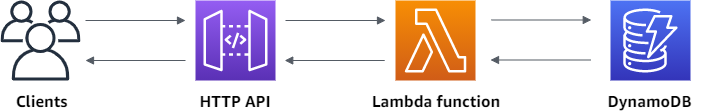

# Tutorial: Build a CRUD API with Lambda and DynamoDB
I've simply created Terraform templates to this [AWS tutorial](https://docs.aws.amazon.com/apigateway/latest/developerguide/http-api-dynamo-db.html)

## Requirements

| Name | Version |
|------|---------|
| terraform | >= 0.15.0 |
| aws | 4.17.1 |

## Providers

| Name | Version |
|------|---------|
| archive | 2.2.0 |
| aws | 4.17.1 |

## Modules

No modules.

## Resources

| Name | Type |
|------|------|
| [aws_apigatewayv2_api.this](https://registry.terraform.io/providers/hashicorp/aws/4.17.1/docs/resources/apigatewayv2_api) | resource |
| [aws_apigatewayv2_integration.this](https://registry.terraform.io/providers/hashicorp/aws/4.17.1/docs/resources/apigatewayv2_integration) | resource |
| [aws_apigatewayv2_route.this](https://registry.terraform.io/providers/hashicorp/aws/4.17.1/docs/resources/apigatewayv2_route) | resource |
| [aws_apigatewayv2_stage.this](https://registry.terraform.io/providers/hashicorp/aws/4.17.1/docs/resources/apigatewayv2_stage) | resource |
| [aws_dynamodb_table.this](https://registry.terraform.io/providers/hashicorp/aws/4.17.1/docs/resources/dynamodb_table) | resource |
| [aws_iam_policy.this](https://registry.terraform.io/providers/hashicorp/aws/4.17.1/docs/resources/iam_policy) | resource |
| [aws_iam_role.this](https://registry.terraform.io/providers/hashicorp/aws/4.17.1/docs/resources/iam_role) | resource |
| [aws_iam_role_policy_attachment.attach_policy_to_iam_role_mi_lambda](https://registry.terraform.io/providers/hashicorp/aws/4.17.1/docs/resources/iam_role_policy_attachment) | resource |
| [aws_lambda_function.this](https://registry.terraform.io/providers/hashicorp/aws/4.17.1/docs/resources/lambda_function) | resource |
| [aws_lambda_permission.this](https://registry.terraform.io/providers/hashicorp/aws/4.17.1/docs/resources/lambda_permission) | resource |
| [archive_file.this](https://registry.terraform.io/providers/hashicorp/archive/latest/docs/data-sources/file) | data source |

## Inputs

| Name | Description | Type | Default | Required |
|------|-------------|------|---------|:--------:|
| environment | Environment Name | `string` | n/a | yes |
| profile | Profile name configured in .aws | `string` | n/a | yes |
| project | Project Name | `string` | n/a | yes |

## Outputs

No outputs.
